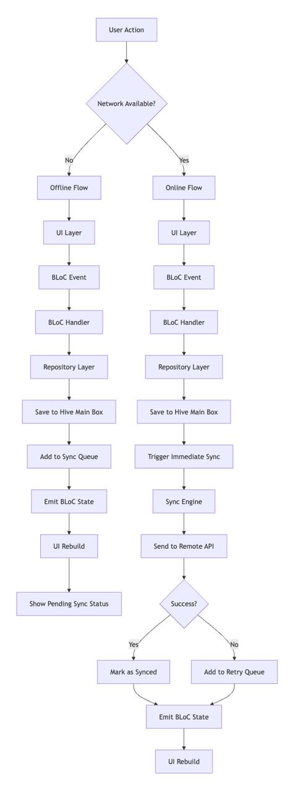
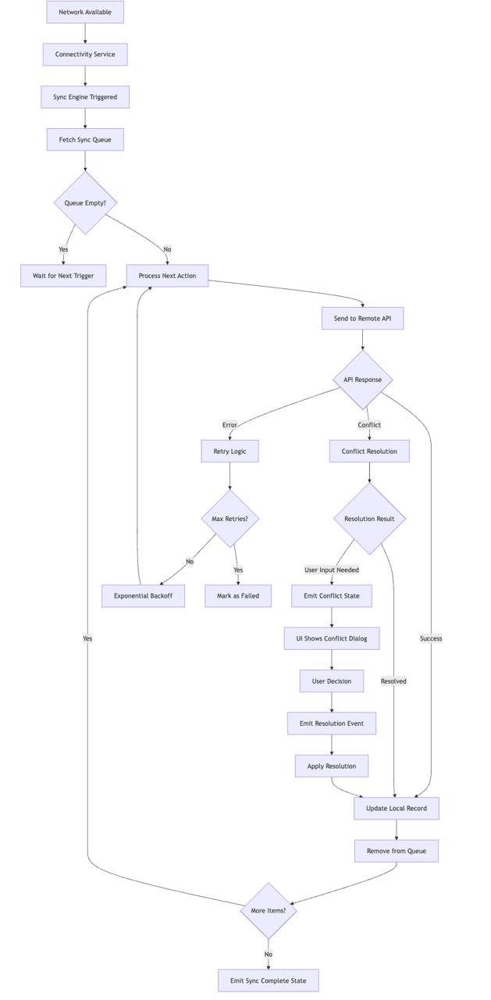
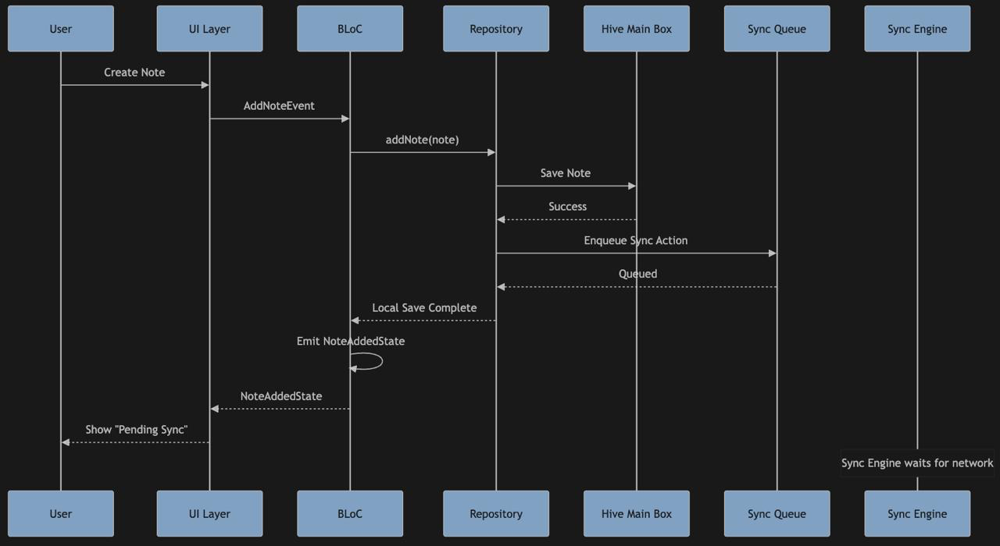
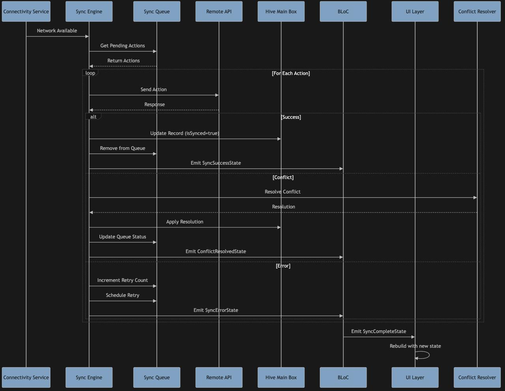
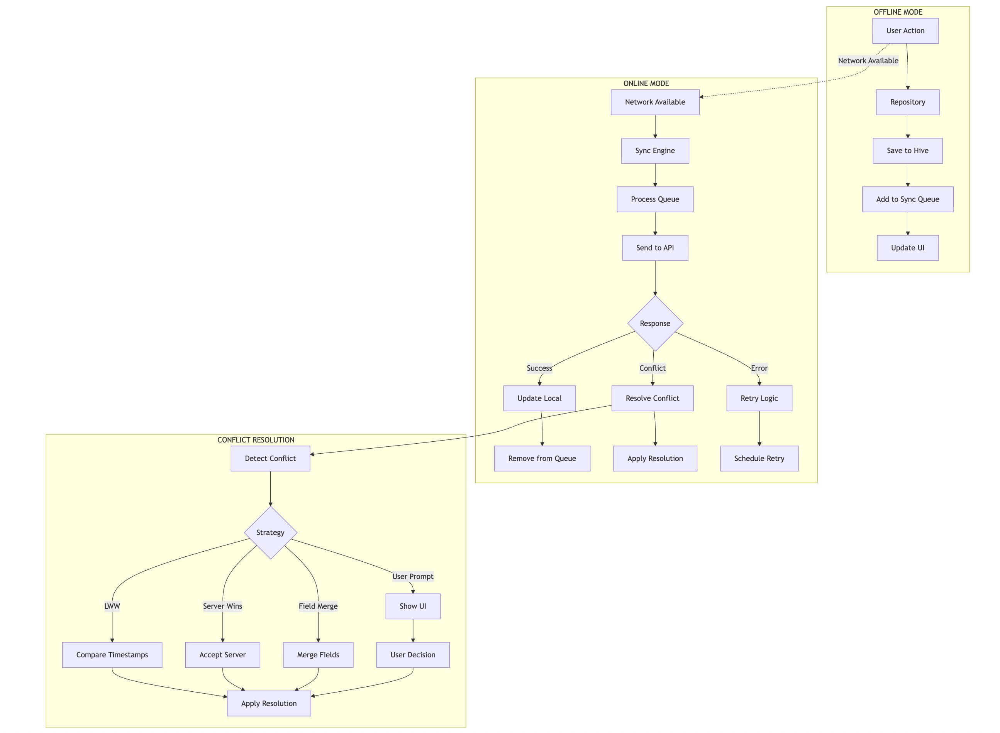

# Flutter Offline-First Architecture with BLoC + Hive + Sync Engine

## Table of Contents
1. [Architecture Overview](#architecture-overview)
2. [Technology Stack](#technology-stack)
3. [System Components](#system-components)
4. [Data Flow Diagrams](#data-flow-diagrams)
5. [Implementation Details](#implementation-details)
6. [BLoC State Management](#bloc-state-management)
7. [Conflict Resolution](#conflict-resolution)
8. [Project Structure](#project-structure)
9. [Code Examples](#code-examples)
10. [Best Practices](#best-practices)

---

## Architecture Overview

The system is designed as a **Flutter offline-first application** that ensures data availability and consistency across online/offline states using Hive for local persistence and a dedicated sync engine for server synchronization.

### Core Architectural Principles
- **Offline-First**: App functions fully offline, with sync as enhancement
- **Eventual Consistency**: Data eventually syncs when network available
- **Conflict Resolution**: Multiple strategies for handling data conflicts
- **Separation of Concerns**: Clear layer separation for maintainability
- **Fault Tolerance**: Graceful handling of network failures and retries

---

## Technology Stack

### Complete Technology Stack with BLoC

```
┌─────────────────────────────────────────────────────────────┐
│                    PRESENTATION LAYER                       │
├─────────────────────────────────────────────────────────────┤
│ • Flutter UI Framework                                      │
│ • Material Design / Cupertino                               │
│ • Custom Widgets & Components                               │
│ • Sync Status Indicators                                    │
└─────────────────────────────────────────────────────────────┘
┌─────────────────────────────────────────────────────────────┐
│                  STATE MANAGEMENT LAYER                     │
├─────────────────────────────────────────────────────────────┤
│ • BLoC (Business Logic Component)                          │
│ • Cubit (Lightweight BLoC)                                 │
│ • Event Sourcing Pattern                                   │
│ • Stream Controllers                                        │
└─────────────────────────────────────────────────────────────┘
┌─────────────────────────────────────────────────────────────┐
│                   BUSINESS LOGIC LAYER                      │
├─────────────────────────────────────────────────────────────┤
│ • Repository Pattern                                        │
│ • Use Cases / Interactors                                   │
│ • Sync Engine                                               │
│ • Conflict Resolution Engine                                │
│ • Retry Manager                                             │
└─────────────────────────────────────────────────────────────┘
┌─────────────────────────────────────────────────────────────┐
│                    DATA ACCESS LAYER                        │
├─────────────────────────────────────────────────────────────┤
│ • Hive Local Storage                                        │
│ • Sync Queue Management                                     │
│ • Data Adapters & Serialization                             │
│ • Caching Layer                                             │
└─────────────────────────────────────────────────────────────┘
┌─────────────────────────────────────────────────────────────┐
│                   INFRASTRUCTURE LAYER                      │
├─────────────────────────────────────────────────────────────┤
│ • Connectivity Service                                      │
│ • Background Sync Service                                   │
│ • Network Service (Dio)                                     │
│ • WorkManager (Background Tasks)                            │
└─────────────────────────────────────────────────────────────┘
┌─────────────────────────────────────────────────────────────┐
│                    EXTERNAL LAYER                           │
├─────────────────────────────────────────────────────────────┤
│ • Remote API (REST/GraphQL)                                │
│ • Cloud Storage                                             │
│ • Push Notifications                                        │
│ • Analytics & Crash Reporting                               │
└─────────────────────────────────────────────────────────────┘
```

### Detailed BLoC Layer Breakdown

```
┌─────────────────────────────────────────────────────────────┐
│                    FLUTTER APP STACK (BLOC)                 │
├─────────────────────────────────────────────────────────────┤
│  UI LAYER                                                   │
│  ┌─────────────────┐ ┌─────────────────┐ ┌─────────────────┐│
│  │   Screens       │ │   Widgets       │ │   Components    ││
│  │   • Home        │ │   • NoteCard    │ │   • SyncStatus  ││
│  │   • Notes       │ │   • UserCard    │ │   • ConflictUI  ││
│  │   • Settings    │ │   • SyncButton  │ │   • RetryDialog ││
│  └─────────────────┘ └─────────────────┘ └─────────────────┘│
├─────────────────────────────────────────────────────────────┤
│  BLOC STATE MANAGEMENT LAYER                               │
│  ┌─────────────────┐ ┌─────────────────┐ ┌─────────────────┐│
│  │     BLOCS       │ │     CUBITS      │ │     EVENTS      ││
│  │   • NotesBloc   │ │   • SyncCubit   │ │   • NoteEvent   ││
│  │   • UsersBloc   │ │   • ConflictCubit│ │   • SyncEvent   ││
│  │   • SyncBloc    │ │   • RetryCubit  │ │   • UserEvent   ││
│  └─────────────────┘ └─────────────────┘ └─────────────────┘│
│  ┌─────────────────┐ ┌─────────────────┐ ┌─────────────────┐│
│  │     STATES      │ │   REPOSITORIES  │ │   USE CASES     ││
│  │   • NoteState   │ │   • NoteRepo    │ │   • CreateNote  ││
│  │   • SyncState   │ │   • UserRepo    │ │   • UpdateNote  ││
│  │   • UserState   │ │   • SyncRepo    │ │   • DeleteNote  ││
│  └─────────────────┘ └─────────────────┘ └─────────────────┘│
├─────────────────────────────────────────────────────────────┤
│  BUSINESS LOGIC LAYER                                       │
│  ┌─────────────────┐ ┌─────────────────┐ ┌─────────────────┐│
│  │   SYNC ENGINE   │ │ CONFLICT RES.   │ │   RETRY MGR     ││
│  │   • QueueMgr    │ │   • LWW         │ │   • Exponential ││
│  │   • BatchSync   │ │   • ServerWins  │ │   • Backoff     ││
│  │   • DeltaSync   │ │   • FieldMerge  │ │   • MaxRetries  ││
│  └─────────────────┘ └─────────────────┘ └─────────────────┘│
├─────────────────────────────────────────────────────────────┤
│  DATA LAYER                                                 │
│  ┌─────────────────┐ ┌─────────────────┐ ┌─────────────────┐│
│  │   HIVE BOXES    │ │   SYNC QUEUE    │ │   ADAPTERS      ││
│  │   • NotesBox    │ │   • ActionQueue │ │   • NoteAdapter ││
│  │   • UsersBox    │ │   • RetryQueue  │ │   • UserAdapter ││
│  │   • ConfigBox   │ │   • ConflictQ   │ │   • SyncAdapter ││
│  └─────────────────┘ └─────────────────┘ └─────────────────┘│
├─────────────────────────────────────────────────────────────┤
│  INFRASTRUCTURE LAYER                                       │
│  ┌─────────────────┐ ┌─────────────────┐ ┌─────────────────┐│
│  │   CONNECTIVITY  │ │   BACKGROUND    │ │   NETWORK       ││
│  │   • Monitor     │ │   • WorkManager │ │   • Dio Client  ││
│  │   • Listener    │ │   • SyncTask    │ │   • Interceptors││
│  │   • Status      │ │   • RetryTask   │ │   • Auth        ││
│  └─────────────────┘ └─────────────────┘ └─────────────────┘│
└─────────────────────────────────────────────────────────────┘
```

---

## System Components

### 1. Model Layer
```dart
// Base sync metadata
class SyncMeta {
  final DateTime lastUpdated;
  final bool isSynced;
  final String? conflictFlag;
  final int retryCount;
  final DateTime? lastSyncAttempt;
}

// Entity with sync metadata
abstract class SyncableEntity {
  String get id;
  SyncMeta get syncMeta;
  Map<String, dynamic> toSyncPayload();
  void updateSyncMeta(SyncMeta meta);
}
```

### 2. Hive Storage Structure
```dart
// Main entity boxes
class NoteBox {
  static const String name = 'notes';
  // Stores actual Note entities
}

class UserBox {
  static const String name = 'users';
  // Stores actual User entities
}

// Sync queue box
class SyncQueueBox {
  static const String name = 'sync_queue';
  // Stores SyncAction entities
}

// Sync action types
enum SyncActionType { create, update, delete }

class SyncAction {
  final String id;
  final SyncActionType type;
  final String entityType;
  final String entityId;
  final Map<String, dynamic> payload;
  final DateTime timestamp;
  final int retryCount;
  final SyncStatus status;
}
```

### 3. Repository Layer
```dart
abstract class BaseRepository<T extends SyncableEntity> {
  Future<void> create(T entity);
  Future<void> update(T entity);
  Future<void> delete(String id);
  Stream<List<T>> watchAll();
  Stream<T?> watchById(String id);
  
  // Sync-specific methods
  Future<void> markAsSynced(String id);
  Future<void> markAsConflict(String id, String conflictReason);
  Future<List<T>> getUnsyncedEntities();
}
```

### 4. Sync Engine Architecture
```dart
class SyncEngine {
  final ConnectivityService _connectivity;
  final SyncQueueService _syncQueue;
  final ConflictResolver _conflictResolver;
  final RetryManager _retryManager;
  
  // Core sync methods
  Future<void> startSync();
  Future<void> stopSync();
  Future<void> processSyncQueue();
  Future<void> syncEntity(SyncAction action);
  
  // Conflict resolution
  Future<SyncResult> resolveConflict(SyncAction action, ServerResponse response);
}
```

---

## Data Flow Diagrams

### 1. Offline Data Flow Diagram


### 2. Online Data Flow Diagram


### 3. Offline Sequence Diagram


### 4. Online Sequence Diagram


### 5. End-to-End Flow Diagram



### 3. BLoC Event Flow Architecture

```
┌─────────────────────────────────────────────────────────────┐
│                    BLOC EVENT FLOW                          │
├─────────────────────────────────────────────────────────────┤
│                                                             │
│  ┌─────────────┐    ┌─────────────┐    ┌─────────────┐     │
│  │    USER     │───►│     UI      │───►│    BLOC     │     │
│  │   ACTION    │    │   LAYER     │    │   EVENT     │     │
│  └─────────────┘    └─────────────┘    └─────────────┘     │
│                              │                   │         │
│                              ▼                   ▼         │
│  ┌─────────────┐    ┌─────────────┐    ┌─────────────┐     │
│  │   SYNC      │◄───│ REPOSITORY  │◄───│   BLOC      │     │
│  │   QUEUE     │    │   LAYER     │    │  HANDLER    │     │
│  └─────────────┘    └─────────────┘    └─────────────┘     │
│         ▲                   │                   │         │
│         │                   ▼                   ▼         │
│  ┌─────────────┐    ┌─────────────┐    ┌─────────────┐     │
│  │   SYNC      │    │    HIVE     │    │   BLOC      │     │
│  │   ENGINE    │    │ MAIN BOXES  │    │   STATE     │     │
│  └─────────────┘    └─────────────┘    └─────────────┘     │
│         │                   ▲                   │         │
│         └───────────────────┼───────────────────┘         │
│                             │                             │
│  ┌─────────────┐    ┌─────────────┐    ┌─────────────┐     │
│  │CONNECTIVITY │    │  RETRY      │    │   UI        │     │
│  │  SERVICE    │    │  MANAGER    │    │ REBUILD     │     │
│  └─────────────┘    └─────────────┘    └─────────────┘     │
│                                                             │
└─────────────────────────────────────────────────────────────┘
```

---

## BLoC State Management

### 1. BLoC Structure

```dart
// Events
abstract class NoteEvent {}

class AddNoteEvent extends NoteEvent {
  final Note note;
  AddNoteEvent(this.note);
}

class UpdateNoteEvent extends NoteEvent {
  final Note note;
  UpdateNoteEvent(this.note);
}

class DeleteNoteEvent extends NoteEvent {
  final String noteId;
  DeleteNoteEvent(this.noteId);
}

class SyncNotesEvent extends NoteEvent {}

// States
abstract class NoteState {}

class NoteInitial extends NoteState {}

class NoteLoading extends NoteState {}

class NoteLoaded extends NoteState {
  final List<Note> notes;
  final SyncStatus syncStatus;
  NoteLoaded(this.notes, this.syncStatus);
}

class NoteAdded extends NoteState {
  final Note note;
  final bool isSynced;
  NoteAdded(this.note, this.isSynced);
}

class NoteUpdated extends NoteState {
  final Note note;
  final bool isSynced;
  NoteUpdated(this.note, this.isSynced);
}

class NoteDeleted extends NoteState {
  final String noteId;
  NoteDeleted(this.noteId);
}

class NoteSyncInProgress extends NoteState {
  final List<Note> notes;
  NoteSyncInProgress(this.notes);
}

class NoteSyncComplete extends NoteState {
  final List<Note> notes;
  NoteSyncComplete(this.notes);
}

class NoteSyncError extends NoteState {
  final String error;
  final List<Note> notes;
  NoteSyncError(this.error, this.notes);
}

class NoteConflictDetected extends NoteState {
  final Note localNote;
  final Note serverNote;
  final String conflictReason;
  NoteConflictDetected(this.localNote, this.serverNote, this.conflictReason);
}
```

### 2. BLoC Implementation

```dart
class NoteBloc extends Bloc<NoteEvent, NoteState> {
  final NoteRepository _noteRepository;
  final SyncEngine _syncEngine;
  final ConnectivityService _connectivityService;
  
  NoteBloc({
    required NoteRepository noteRepository,
    required SyncEngine syncEngine,
    required ConnectivityService connectivityService,
  }) : _noteRepository = noteRepository,
       _syncEngine = syncEngine,
       _connectivityService = connectivityService,
       super(NoteInitial()) {
    
    on<AddNoteEvent>(_onAddNote);
    on<UpdateNoteEvent>(_onUpdateNote);
    on<DeleteNoteEvent>(_onDeleteNote);
    on<SyncNotesEvent>(_onSyncNotes);
    
    // Listen to connectivity changes
    _connectivityService.connectivityStream.listen((isConnected) {
      if (isConnected) {
        add(SyncNotesEvent());
      }
    });
  }
  
  Future<void> _onAddNote(AddNoteEvent event, Emitter<NoteState> emit) async {
    try {
      emit(NoteLoading());
      
      // Save note locally
      await _noteRepository.addNote(event.note);
      
      // Check if online for immediate sync
      final isOnline = await _connectivityService.isConnected;
      
      if (isOnline) {
        // Trigger immediate sync
        await _syncEngine.syncEntity(event.note);
        emit(NoteAdded(event.note, true));
      } else {
        // Note will be synced when online
        emit(NoteAdded(event.note, false));
      }
      
      // Load updated notes
      final notes = await _noteRepository.getAllNotes();
      emit(NoteLoaded(notes, SyncStatus.idle));
      
    } catch (e) {
      emit(NoteSyncError(e.toString(), []));
    }
  }
  
  Future<void> _onSyncNotes(SyncNotesEvent event, Emitter<NoteState> emit) async {
    try {
      final notes = await _noteRepository.getAllNotes();
      emit(NoteSyncInProgress(notes));
      
      await _syncEngine.processSyncQueue();
      
      final updatedNotes = await _noteRepository.getAllNotes();
      emit(NoteSyncComplete(updatedNotes));
      
    } catch (e) {
      final notes = await _noteRepository.getAllNotes();
      emit(NoteSyncError(e.toString(), notes));
    }
  }
}
```

---

## Conflict Resolution

### 1. Conflict Resolution Strategies

```dart
abstract class ConflictResolver {
  Future<ConflictResolution> resolve(ConflictContext context);
}

class LastWriteWinsResolver implements ConflictResolver {
  @override
  Future<ConflictResolution> resolve(ConflictContext context) async {
    final localTime = context.localEntity.syncMeta.lastUpdated;
    final serverTime = context.serverResponse.serverTimestamp;
    
    if (localTime.isAfter(serverTime)) {
      return ConflictResolution.keepLocal;
    } else {
      return ConflictResolution.acceptServer;
    }
  }
}

class ServerWinsResolver implements ConflictResolver {
  @override
  Future<ConflictResolution> resolve(ConflictContext context) async {
    return ConflictResolution.acceptServer;
  }
}

class FieldLevelMergeResolver implements ConflictResolver {
  @override
  Future<ConflictResolution> resolve(ConflictContext context) async {
    // Implement field-level merging logic
    final mergedData = _mergeFields(
      context.localEntity.toSyncPayload(),
      context.serverResponse.data,
    );
    
    return ConflictResolution.merge(mergedData);
  }
  
  Map<String, dynamic> _mergeFields(
    Map<String, dynamic> local,
    Map<String, dynamic> server,
  ) {
    // Custom merge logic based on field types
    final merged = Map<String, dynamic>.from(local);
    
    // Example: merge tags arrays
    if (local['tags'] is List && server['tags'] is List) {
      final localTags = List<String>.from(local['tags']);
      final serverTags = List<String>.from(server['tags']);
      merged['tags'] = [...localTags, ...serverTags].toSet().toList();
    }
    
    // Example: keep server timestamp for lastUpdated
    merged['lastUpdated'] = server['lastUpdated'];
    
    return merged;
  }
}
```

### 2. Conflict Resolution Context

```dart
class ConflictContext {
  final SyncableEntity localEntity;
  final ServerResponse serverResponse;
  final String conflictReason;
  final Map<String, dynamic> conflictFields;
  
  ConflictContext({
    required this.localEntity,
    required this.serverResponse,
    required this.conflictReason,
    required this.conflictFields,
  });
}

enum ConflictResolution {
  keepLocal,
  acceptServer,
  merge(Map<String, dynamic> mergedData),
  requireUserInput,
}

class ConflictResolutionResult {
  final ConflictResolution resolution;
  final String? reason;
  final Map<String, dynamic>? mergedData;
  
  ConflictResolutionResult({
    required this.resolution,
    this.reason,
    this.mergedData,
  });
}
```

---

## Project Structure

```
lib/
├── core/
│   ├── models/
│   │   ├── sync_meta.dart
│   │   └── syncable_entity.dart
│   ├── storage/
│   │   ├── hive_service.dart
│   │   ├── sync_queue_service.dart
│   │   └── box_registry.dart
│   ├── sync/
│   │   ├── sync_engine.dart
│   │   ├── conflict_resolver.dart
│   │   └── retry_manager.dart
│   ├── connectivity/
│   │   └── connectivity_service.dart
│   └── errors/
│       ├── sync_exceptions.dart
│       └── conflict_exceptions.dart
├── features/
│   ├── notes/
│   │   ├── models/
│   │   │   └── note.dart
│   │   ├── repositories/
│   │   │   └── note_repository.dart
│   │   ├── bloc/
│   │   │   ├── note_bloc.dart
│   │   │   ├── note_event.dart
│   │   │   └── note_state.dart
│   │   ├── widgets/
│   │   │   ├── note_card.dart
│   │   │   ├── sync_status_indicator.dart
│   │   │   └── conflict_resolution_dialog.dart
│   │   └── screens/
│   │       └── notes_screen.dart
│   └── users/
│       ├── models/
│       │   └── user.dart
│       ├── repositories/
│       │   └── user_repository.dart
│       ├── bloc/
│       │   ├── user_bloc.dart
│       │   ├── user_event.dart
│       │   └── user_state.dart
│       └── screens/
│           └── users_screen.dart
├── services/
│   ├── api/
│   │   └── remote_api.dart
│   └── sync/
│       └── background_sync_service.dart
├── shared/
│   ├── widgets/
│   │   ├── loading_widget.dart
│   │   ├── error_widget.dart
│   │   └── retry_button.dart
│   └── utils/
│       ├── date_utils.dart
│       └── validation_utils.dart
└── main.dart
```

---

## Code Examples

### 1. Hive Adapter Implementation

```dart
@HiveType(typeId: 0)
class Note extends SyncableEntity {
  @HiveField(0)
  final String id;
  
  @HiveField(1)
  final String title;
  
  @HiveField(2)
  final String content;
  
  @HiveField(3)
  final SyncMeta syncMeta;
  
  @HiveField(4)
  final List<String> tags;
  
  @HiveField(5)
  final DateTime createdAt;
  
  Note({
    required this.id,
    required this.title,
    required this.content,
    required this.syncMeta,
    this.tags = const [],
    required this.createdAt,
  });
  
  @override
  Map<String, dynamic> toSyncPayload() => {
    'id': id,
    'title': title,
    'content': content,
    'tags': tags,
    'createdAt': createdAt.toIso8601String(),
    'lastUpdated': syncMeta.lastUpdated.toIso8601String(),
  };
  
  @override
  void updateSyncMeta(SyncMeta meta) {
    // Update sync metadata
  }
  
  Note copyWith({
    String? id,
    String? title,
    String? content,
    SyncMeta? syncMeta,
    List<String>? tags,
    DateTime? createdAt,
  }) {
    return Note(
      id: id ?? this.id,
      title: title ?? this.title,
      content: content ?? this.content,
      syncMeta: syncMeta ?? this.syncMeta,
      tags: tags ?? this.tags,
      createdAt: createdAt ?? this.createdAt,
    );
  }
}
```

### 2. Repository Implementation

```dart
class NoteRepository implements BaseRepository<Note> {
  final HiveService _hiveService;
  final SyncQueueService _syncQueue;
  final ConnectivityService _connectivity;
  
  NoteRepository({
    required HiveService hiveService,
    required SyncQueueService syncQueue,
    required ConnectivityService connectivity,
  }) : _hiveService = hiveService,
       _syncQueue = syncQueue,
       _connectivity = connectivity;
  
  @override
  Future<void> create(Note note) async {
    // Save to Hive
    await _hiveService.notesBox.put(note.id, note);
    
    // Add to sync queue if offline
    if (!await _connectivity.isConnected) {
      await _syncQueue.enqueue(SyncAction(
        id: Uuid().v4(),
        type: SyncActionType.create,
        entityType: 'Note',
        entityId: note.id,
        payload: note.toSyncPayload(),
        timestamp: DateTime.now(),
        retryCount: 0,
        status: SyncStatus.pending,
      ));
    }
  }
  
  @override
  Future<void> update(Note note) async {
    // Update in Hive
    await _hiveService.notesBox.put(note.id, note);
    
    // Add to sync queue if offline
    if (!await _connectivity.isConnected) {
      await _syncQueue.enqueue(SyncAction(
        id: Uuid().v4(),
        type: SyncActionType.update,
        entityType: 'Note',
        entityId: note.id,
        payload: note.toSyncPayload(),
        timestamp: DateTime.now(),
        retryCount: 0,
        status: SyncStatus.pending,
      ));
    }
  }
  
  @override
  Future<void> delete(String id) async {
    // Delete from Hive
    await _hiveService.notesBox.delete(id);
    
    // Add to sync queue if offline
    if (!await _connectivity.isConnected) {
      await _syncQueue.enqueue(SyncAction(
        id: Uuid().v4(),
        type: SyncActionType.delete,
        entityType: 'Note',
        entityId: id,
        payload: {'id': id},
        timestamp: DateTime.now(),
        retryCount: 0,
        status: SyncStatus.pending,
      ));
    }
  }
  
  @override
  Stream<List<Note>> watchAll() {
    return _hiveService.notesBox.watch().map((box) {
      return box.values.cast<Note>().toList();
    });
  }
  
  @override
  Stream<Note?> watchById(String id) {
    return _hiveService.notesBox.watch().map((box) {
      return box.get(id) as Note?;
    });
  }
  
  @override
  Future<void> markAsSynced(String id) async {
    final note = _hiveService.notesBox.get(id) as Note?;
    if (note != null) {
      final updatedNote = note.copyWith(
        syncMeta: SyncMeta(
          lastUpdated: DateTime.now(),
          isSynced: true,
          conflictFlag: null,
          retryCount: 0,
          lastSyncAttempt: DateTime.now(),
        ),
      );
      await _hiveService.notesBox.put(id, updatedNote);
    }
  }
  
  @override
  Future<void> markAsConflict(String id, String conflictReason) async {
    final note = _hiveService.notesBox.get(id) as Note?;
    if (note != null) {
      final updatedNote = note.copyWith(
        syncMeta: SyncMeta(
          lastUpdated: note.syncMeta.lastUpdated,
          isSynced: false,
          conflictFlag: conflictReason,
          retryCount: note.syncMeta.retryCount,
          lastSyncAttempt: DateTime.now(),
        ),
      );
      await _hiveService.notesBox.put(id, updatedNote);
    }
  }
  
  @override
  Future<List<Note>> getUnsyncedEntities() async {
    return _hiveService.notesBox.values
        .cast<Note>()
        .where((note) => !note.syncMeta.isSynced)
        .toList();
  }
}
```

### 3. UI Integration with BLoC

```dart
class NotesScreen extends StatelessWidget {
  @override
  Widget build(BuildContext context) {
    return BlocBuilder<NoteBloc, NoteState>(
      builder: (context, state) {
        if (state is NoteLoading) {
          return Center(child: CircularProgressIndicator());
        } else if (state is NoteLoaded) {
          return NotesList(
            notes: state.notes,
            syncStatus: state.syncStatus,
          );
        } else if (state is NoteSyncError) {
          return ErrorWidget(
            error: state.error,
            onRetry: () => context.read<NoteBloc>().add(SyncNotesEvent()),
          );
        } else if (state is NoteConflictDetected) {
          return ConflictResolutionDialog(
            localNote: state.localNote,
            serverNote: state.serverNote,
            conflictReason: state.conflictReason,
            onResolve: (resolution) {
              // Handle conflict resolution
            },
          );
        }
        
        return Container();
      },
    );
  }
}

class NotesList extends StatelessWidget {
  final List<Note> notes;
  final SyncStatus syncStatus;
  
  const NotesList({
    required this.notes,
    required this.syncStatus,
  });
  
  @override
  Widget build(BuildContext context) {
    return Column(
      children: [
        // Sync status indicator
        SyncStatusIndicator(status: syncStatus),
        
        // Notes list
        Expanded(
          child: ListView.builder(
            itemCount: notes.length,
            itemBuilder: (context, index) {
              final note = notes[index];
              return NoteCard(
                note: note,
                onEdit: () => _editNote(context, note),
                onDelete: () => _deleteNote(context, note),
              );
            },
          ),
        ),
      ],
    );
  }
  
  void _editNote(BuildContext context, Note note) {
    // Navigate to edit screen
  }
  
  void _deleteNote(BuildContext context, Note note) {
    context.read<NoteBloc>().add(DeleteNoteEvent(note.id));
  }
}
```

### 4. Sync Status Indicator

```dart
class SyncStatusIndicator extends StatelessWidget {
  final SyncStatus status;
  
  const SyncStatusIndicator({required this.status});
  
  @override
  Widget build(BuildContext context) {
    return Container(
      padding: EdgeInsets.all(8.0),
      child: Row(
        children: [
          Icon(
            _getStatusIcon(),
            color: _getStatusColor(),
            size: 16,
          ),
          SizedBox(width: 8),
          Text(
            _getStatusText(),
            style: TextStyle(
              color: _getStatusColor(),
              fontSize: 12,
            ),
          ),
        ],
      ),
    );
  }
  
  IconData _getStatusIcon() {
    switch (status) {
      case SyncStatus.idle:
        return Icons.check_circle;
      case SyncStatus.syncing:
        return Icons.sync;
      case SyncStatus.error:
        return Icons.error;
      case SyncStatus.conflict:
        return Icons.warning;
    }
  }
  
  Color _getStatusColor() {
    switch (status) {
      case SyncStatus.idle:
        return Colors.green;
      case SyncStatus.syncing:
        return Colors.blue;
      case SyncStatus.error:
        return Colors.red;
      case SyncStatus.conflict:
        return Colors.orange;
    }
  }
  
  String _getStatusText() {
    switch (status) {
      case SyncStatus.idle:
        return 'All synced';
      case SyncStatus.syncing:
        return 'Syncing...';
      case SyncStatus.error:
        return 'Sync error';
      case SyncStatus.conflict:
        return 'Conflict detected';
    }
  }
}
```

### 5. Dependencies (pubspec.yaml)

```yaml
dependencies:
  flutter:
    sdk: flutter
  hive: ^2.2.3
  hive_flutter: ^1.1.0
  flutter_bloc: ^8.1.3
  connectivity_plus: ^5.0.2
  uuid: ^4.2.1
  dio: ^5.4.0
  workmanager: ^0.5.2
  equatable: ^2.0.5

dev_dependencies:
  flutter_test:
    sdk: flutter
  hive_generator: ^2.0.1
  build_runner: ^2.4.7
  bloc_test: ^9.1.5
  mockito: ^5.4.2
```

---

## Best Practices

### 1. State Management
- Use BLoC for complex state management
- Use Cubit for simple state management
- Keep BLoCs focused on single features
- Use Equatable for state comparison
- Emit states in the correct order

### 2. Data Persistence
- Use Hive for local storage
- Implement proper data adapters
- Handle data migration gracefully
- Use transactions for batch operations
- Implement proper error handling

### 3. Sync Engine
- Implement exponential backoff for retries
- Use batch sync to reduce API calls
- Handle conflicts gracefully
- Provide user feedback for sync status
- Implement proper error recovery

### 4. Conflict Resolution
- Implement multiple resolution strategies
- Provide user choice for critical conflicts
- Log conflict resolution decisions
- Test conflict scenarios thoroughly
- Document resolution policies

### 5. Error Handling
- Implement comprehensive error handling
- Provide meaningful error messages
- Log errors for debugging
- Implement retry mechanisms
- Handle network failures gracefully

### 6. Testing
- Write unit tests for BLoCs
- Test repository implementations
- Mock external dependencies
- Test offline/online scenarios
- Test conflict resolution

### 7. Performance
- Use lazy loading for large datasets
- Implement pagination
- Optimize Hive queries
- Use background sync
- Monitor memory usage

### 8. Security
- Encrypt sensitive data
- Use secure storage
- Implement proper authentication
- Validate all inputs
- Handle sensitive data properly

---

This comprehensive architecture provides a robust, production-ready foundation for a Flutter offline-first application using BLoC, Hive, and a dedicated sync engine. The design ensures reliable offline functionality with proper conflict resolution and state management.
